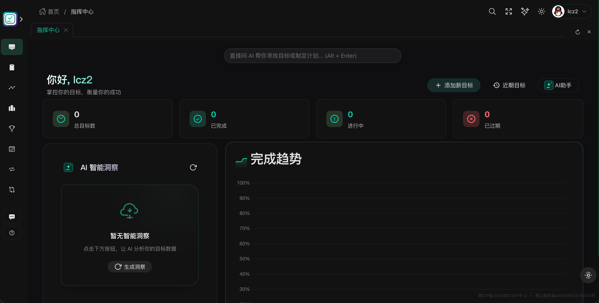

# FreeMix -- 目标管理系统

FreeMix 是一个全栈目标管理应用，支持 Web、桌面端和移动端使用。

## 项目简介

核心思路是帮助个人或团队管理目标、追踪进度，并提供 AI 辅助来提高效率。除了常规的目标 CRUD 和子任务管理外，还内置了数据可视化、循环任务、协作分享、成就系统等功能。

## 截图预览

<div align="center">
  
  &nbsp;&nbsp;
  
</div>

## 技术栈

**前端**
- Vue 3 + TypeScript + Vite
- UI 框架：Naive UI（桌面端）+ Vant（移动端），部分页面混用 Element Plus
- 状态管理：Vuex + Pinia
- 图表：Chart.js / ECharts
- 流程图：LogicFlow
- 富文本编辑器：TinyMCE / Quill
- 桌面壳：Electron
- 移动壳：Capacitor（iOS / Android）
- WebSocket 实时通信：STOMP + SockJS

**后端**
- Java / Spring Boot
- 数据库：MongoDB
- 缓存：Redis
- 实时通信：WebSocket + STOMP
- 认证：JWT + Google Authenticator（2FA）+ GitHub OAuth2 + QQ OAuth2
- AI：DeepSeek API（流式对话 + 目标生成）

## 功能模块

### 用户认证
- 支持四种登录方式：用户名/密码、邮箱验证码、二维码扫码、GitHub / QQ OAuth2
- 双因素认证（2FA）绑定与验证
- 桌面端（30天有效）和移动端（长期有效）的独立 token 策略

### 目标管理
- 创建 / 编辑 / 删除目标，支持树形嵌套子目标
- 按标题、优先级、截止时间三种维度分组查看
- 目标续签（每次延长 30 天，每个目标最多 3 次）
- 一键完成：将目标下所有子目标批量标记为完成
- Excel 批量导入目标 / 数据导出（CSV、Excel、JSON、XML、SQL、DMP 六种格式）
- 回收站机制（软删除后 30 天内可恢复）
- 协作人管理：添加协作者、分配角色

### AI 助手
- 基于 DeepSeek 的流式对话
- AI 目标生成：用自然语言描述需求，自动生成结构化的目标
- AI 晨报：每日自动生成当日目标概览
- AI 智能洞察：分析目标数据，生成改进建议

### 循环目标
- 支持按天、周、月自动化创建目标
- 支持 Cron 表达式定制执行时间
- 每个循环任务可预设子目标模板

### 数据统计
- 状态分布饼图（已完成 / 进行中 / 已过期）
- 月度完成趋势折线图
- 目标类型分布统计
- 首页仪表盘：完成率趋势 + AI 洞察摘要

### 社交与协作
- 好友系统：搜索用户、发送申请、通过 / 拒绝、删除
- 站内私信：支持 WebSocket 实时推送，消息中心和聊天窗口
- 目标评论：在目标详情页下讨论
- 公开目标广场：浏览他人公开目标，支持点赞、收藏、分享、引用

### 目标可视化
- 基于 LogicFlow 的目标结构图（节点 + 连线）
- 支持拖拽编辑节点、导出快照

### 成就系统
- 预设多类成就（如创建首个目标、完成 10 个目标等）
- 进度追踪和完成率展示

### 日历
- 月视图日历，展示目标截止日期分布

### 消息通知
- 站内通知系统
- 移动端推送通知同步
- 桌面端系统通知

### 设置
- 个人资料编辑
- 安全设置（修改密码 / 2FA 管理）
- 客户端下载地址配置（管理员）
- 全量数据导出与格式选择

### 系统管理
- API 调用日志审计
- 登录日志查询
- 更新日志发布与管理
- 反馈中心

## 跨平台支持

| 平台 | 实现方式 | 说明 |
|------|---------|------|
| Web | Vite 构建 | 浏览器直接访问 |
| macOS / Windows / Linux | Electron | 独立桌面应用，系统托盘、原生菜单、离线数据 |
| iOS / Android | Capacitor | 原生壳加载 WebView，支持摄像头、推送等原生能力 |

## 项目结构

```
freemix/
  admin/freemix/     -- 前端（Vue 3 + Vite + Electron + Capacitor）
    src/views/       -- 页面视图
    src/components/  -- 通用组件
    src/router/      -- 路由配置
    src/utils/       -- 工具函数
    electron/        -- Electron 主进程
  server/            -- 后端（Spring Boot）
    src/main/java/com/freemix/freemix/
      controller/    -- API 控制器
      service/       -- 业务逻辑
      enetiy/        -- 数据模型
```

## 本地运行

前端：

```bash
cd admin/freemix
npm install
npm run dev            # 启动开发服务器 (localhost:5173)
```

后端（需要 JDK 17 + MongoDB + Redis）：

```bash
cd server
./mvnw spring-boot:run
```

桌面端开发模式：

```bash
cd admin/freemix
npm run electron:dev   # 同时启动 Vite 和 Electron
```

## 构建与发布

Web 版本：

```bash
cd admin/freemix
npm run build          # 输出到 dist/
```

macOS 桌面安装包：

```bash
cd admin/freemix
./build-mac.sh
```

Windows 桌面安装包：

```bash
cd admin/freemix
./build-win.sh
```

## License

MIT
